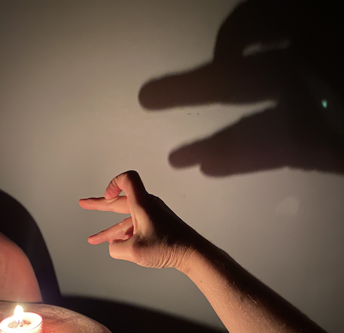

# 🤚 🤙 👋 Ombromanie: Create a Hand Shadow Show using Machine Learning 👋 🤙 🤚

Telling stories by casting hand shadows is an ancient Asian art form, popularized in the 18th century in Europe. The effect can be achieved simply by turning out all lights and using one candle and one person making shadows in front of a screen or wall. It's a fun way to entertain yourself and the kids by creating stories on a wall with just your hands.

Try the app [live](https://aka.ms/ombromanie)!



What if, however, you're clean out of candles and it's the middle of the day and you're bored working from home? Time to reproduce the experience of an Ombromanie show...but using a web app!

## Architecture

In this demo, we use TensorFlow.js's HandPose library, which unfortunately right now only allows you to use one hand to project poses to the screen. However you can tell a story using this web app, record it, and save it as a local file to send to someone as a gift.

The shadow casting is handled by leveraging the Canvas API in the browser, copying the keypoints of the moving hand and using an offset shadow to show a fuzzy black image mimicking a shadow to a white background, like a wall.

The web app is done in Vue.js with an Azure Function handling delivery of a key, needed by [Microsoft Cognitive Services Speech-To-Text Service](https://docs.microsoft.com/en-us/azure/cognitive-services/speech-service?WT.mc_id=academic-12390-jelooper).
## Project setup to run locally

CD to your project's /app folder and type:

```
npm install
```
### Compiles and hot-reloads for development
```
npm run serve
```

### Compiles and minifies for production
```
npm run build
```

### Lints and fixes files
```
npm run lint
```
To run the function locally, CD to the /api folder and in its root, add a `local.settings.json` file. In that file, paste the following code:

```json
{
	"IsEncrypted": false,
	"Values": {
		"AzureWebJobsStorage": "",
		"FUNCTIONS_WORKER_RUNTIME": "node",
		"VUE_APP_SPEECH_KEY": "add-a-key-here"
	}
}
```
Obtain a Speech-To-Text key by [subscribing to the service](https://azure.microsoft.com/en-us/services/cognitive-services/speech-to-text?WT.mc_id=academic-12390-jelooper).

This code shows the implementation in Show.vue:

```javascript
async startAudioTranscription() {
      try {
        //get the key
        const response = await axios.get("/api/getKey");
        this.subKey = response.data;
        //sdk

        let speechConfig = sdk.SpeechConfig.fromSubscription(
          this.subKey,
          "eastus"
        );
        let audioConfig = sdk.AudioConfig.fromDefaultMicrophoneInput();
        this.recognizer = new sdk.SpeechRecognizer(speechConfig, audioConfig);

        this.recognizer.recognized = (s, e) => {
          this.text = e.result.text;
          this.story.push(this.text);
        };

        this.recognizer.startContinuousRecognitionAsync();
      } catch (error) {
        this.message = error;
      }
    },
```

Create your shadow-stories, click record, and save them plus your speech text in the app. You can then scrape to an email or other sharing format.

## Hosting

This web app is hosted on Azure as an Azure Static Web App. Host your own using this button:

[](https://portal.azure.com/?feature.customportal=false&WT.mc_id=academic-12390-jelooper#create/Microsoft.StaticApp)

Learn more about [Azure Static Web Apps](https://docs.microsoft.com/en-us/learn/paths/deploy-a-website-with-azure-app-service?WT.mc_id=academic-12390-jelooper) by building one!

## Learn more

Blogpost Coming Soon!

[Slides](ombromanie.pptx), presented at WebStories Conf, Lille.